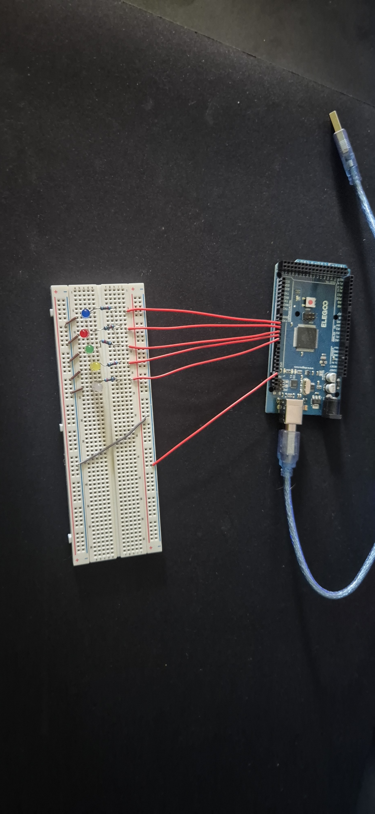

# Knight Rider (Lauflicht)

Five LEDs light up one after another from left to right, then turn off one after another from right to left, looping continuously. Pins 2-6 (`LED[0]`-`LED[4]`).

No button - it starts automatically in `loop()`. Built with an array and two `for` loops instead of writing each LED by hand.

